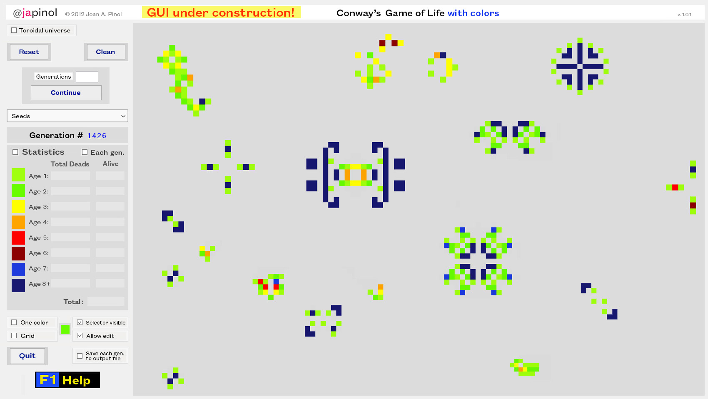
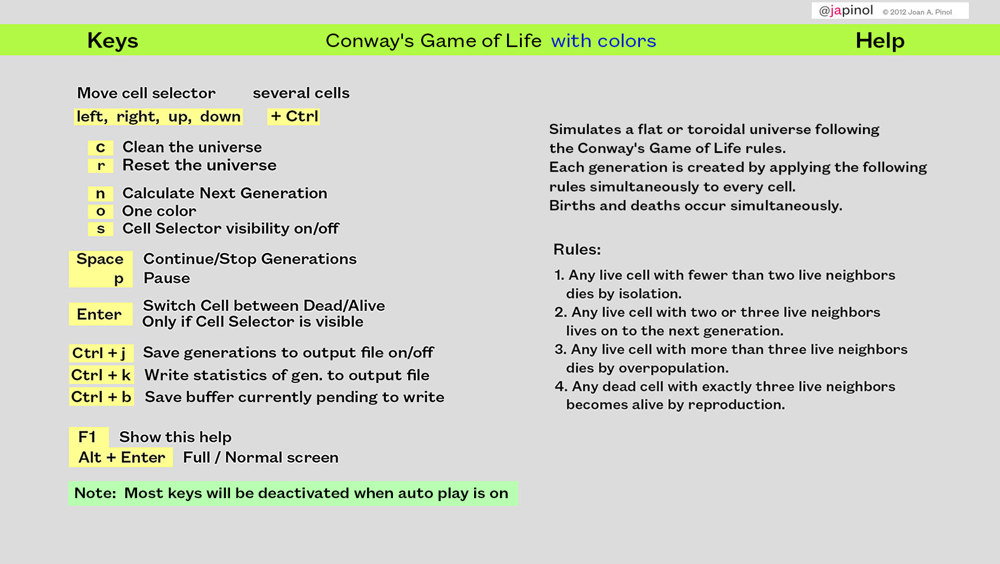

## Warning - Development version. GUI under construction

	TODO: Implement graphical user interface (GUI) elements:
            * Buttons, check boxes and list boxes.
	      It will be implemented using ThorPy, probably.

	So, for the moment you will have to use the keyboard keys and the line command parameters.
	Apart from these GUI elements, this version is fully operational.

## Life

	Conway's Game of Life with colors.
	Conway's Game of Life classic or with colors for the first 8 generations.
	Objective: Simulates a universe following the Conway's Game of Life rules.
		By default uses colors to represent the first 8 generations of a cell alive.
		The user can choose between two representations of a universe: toroidal or flat. 
	program: life
	version: 1.0.1
	language: English
	author: Joan A. Pinol
	author_nickname: japinol
	author_gitHub: japinol7
	author_twitter: @japinol
	requirements: pygame
	Python requires: 3.6 or greater.
	Python versions tested: 3.7.3 64bits under Windows 10

## Screenshots

  
 
  

## Rules and user guide

	Simulates a universe following the Conway's Game of Life rules.
	By default uses colors to represent the first 8 generations of a live cell.
	The user can choose between two representations of a universe: toroidal or flat.

	The game of life was invented by the mathematithian John H. Conway in 1970
	in response to a problem of John von Neumann who was looking
	for a machine capable of self-replication.

	The standard Game of Life is symbolized as B3/S23.
	In it, a cell is born if it has exactly three neighbors, 
	survives if it has two or three living neighbors, and dies otherwise.

	The Rules:
	1. Any live cell with fewer than two live neighbors dies by isolation.
	2. Any live cell with two or three live neighbors lives on to the next generation.
	3. Any live cell with more than three live neighbors dies by over population.
	4. Any dead cell with exactly three live neighbors becomes alive by reproduction.

	The initial pattern constitutes the seed of the system. 
	The first generation is created by applying the above rules simultaneously 
	to every cell in the seed. Births and deaths occur simultaneously.

## Recommended reading

	Conway's Game of Life in Wikipedia:
		[Wikipedia](https://en.wikipedia.org/wiki/Conway's_Game_of_Life)

	Peter Norvig's explanation using a Jupyter Notebook:
		[Norvig](https://nbviewer.jupyter.org/url/norvig.com/ipython/Life.ipynb)

## Keyboard keys
		 F1:    show a help screen on the graphic user interface
		 ^h:    shows this help to the console
		  p:    pause
		 ESC:    cancel or quit
                    must be pressed 4 times when auto play mode is activated.

		  left,      move cursor to the left
		  right,     move cursor to the right
		  up,        move cursor up
		  down,      move cursor down
		  Ctrl + movement key: move selector several cells

		  c:    clean the universe
		  r:    reset the universe

		  n:    calculate next generation
		  o:    one color
		  s:    cell selector visibility on/off
		 Space: continue/stop generations
		 Enter: switch cell between dead/alive
	              only if cell selector is visible

		 ^j: save generations to output file on/off
		 ^k: write statistics for current generation to output file
		     (only if are actitated)
		 ^b: save buffer currently pending to write to output file
             
		 Alt + Enter: change full screen / normal screen mode
		 L_Ctrl + R_Alt + g: grid on/off

		 ^d:    print debug information to the console
		 ^l:    write debug information to a log file

            Note:  Most keys will be deactivated when auto play is activated.

## Usage

	life [-h] [-c CELLSIZE] [-m] [-o] [-u] [-w WIDTHSCREEN]
	     [-e HEIGHTSCREEN] [-f] [-s SPEED] [-n] [-i] [-k SEEDS]
	     [-v OUTFILE] [-x] [-l LOGFILE] [-a] [-j] [-p STOPAFTER]
         [-y] [-z] [-zz] [-t] [-ts]
	
	optional arguments:
	  -h, --help            show this help message and exit
	  -c CELL_SIZE, 	--cellsize CELL_SIZE
	                        the size of each cell. Must be between 4 and 10.
	  -m, 			--emptyuniverse
	                        start with an empty universe.
	  -o, 			--onecolor
	                        use one color, the way the classic Conway's Game of Life does.
	  -u, 			--toroidaluniverse
	                        the universe is represented by a toroidal array instead of a flat one.
	  -w SCREEN_WIDTH, 	--widthscreen SCREEN_WIDTH
	                        the width of the screen. Must be between 1700 and 1920
	  -e SCREEN_HEIGHT, --heightscreen SCREEN_WIDTH
	                        the height of the screen. Must be between 959 and 1080
	  -f, 			--fullscreen
	                        start the game in full screen mode.
	  -s SPEED,     --speed SPEED
	                        change the speed of each generation.
	                        It will calculate a generation every N seconds if possible.
	  -n, 			--editnotallowed
	                        will not allow edit the universe by changing the value of a cell.
	  -i, 			--startimmediately
	                        start calculating generations with the initial seed/s immediately.
	  -k SEEDS, 	--seeds SEEDS
	                        use specified starting seeds and their positions.
	                        Usage: --seeds "SEED1 Y_POS X_POS, SEED2 Y_POS X_POS"
	                        Example: --seeds "clock 10 20, glider 20 30"
	                        You can use these seeds:
							acorn, beacon, bee_hive, blinker,
							blinkers_bit_pole, block, block_switch_engine,
							circle_of_fire, boat, clock, diehard, explode,
							explode_small, glider, gosper_glider_gun, infinite,
							infinite_5x5, infinite_6x8, infinite_1x39, loaf,
							pentadecathlon, pentomino_o, pentomino_p, pentomino_q,
							pentomino_r, pentomino_s, pentomino_t, pentomino_u,
							pentomino_v, pentomino_w, pentomino_x, pentomino_y,
							pentomino_z, pulsar, quad_pole, spaceship_light,
							spaceship_medium, spaceship_heavy,
							spaceship_25p3h1v0.1, sparker_101, toad, tub.
	  -v OUT_FILE, --outfile OUT_FILE
	                        output file where there will be written the results
	                        when 'save generations to file' is activated.
	  -x, 			--savetofile
	                        save generations to output file.
	  -l LOG_FILE, 	--logfile LOG_FILE
	                        output log file where the results will be written.
	  -a, 			--auto
	                        automatic mode. The following actions are not allowed:
	                        Stop generations, pause generations, calculate
	                        only the next generation, show graphic help screen,
                            edit the board, change the shape of the universe,
                            clean or reset the universe, change full/normal screen...
                            Also, you must press ESC or Quit 4 times to exit the life game.
                            Also, activates start immediately flag.
	                        This option it is useful for benchmark purposes and more.
	  -j, 			--exitauto
	                        exit immediately if the automatic mode is on.
	  -p STOPAFTER, --stopafter STOPAFTER
	                        change the speed of each generation.
	                        It will calculate a generation every N nanoseconds if possible.
	  -y, 			--timeinoutfile
	                        save current time in output file for each generation.
	  -z, 			--statsoff
	                        deactivate statistics for total dead cells and current cells alive.
	  -zz, 			--statsnogui
	                        even if statistics are activated, do not reflect the middle
                            calculations on the GUI. Only draw the last one.
	  -t, 			--debugtraces
	                        show debug back traces information when something goes wrong.
	  -ts, 			--testsuite
	                        execute the test suite and exit.
                            This test suite tests 2 universes in their flat and toroidal versions.
                            They just creates each universe, calculates the first 550 generations,
                            saves the results in the output file and compares these results
                            with previous output files that are correct.

**Default optional arguments**

        CELL_SIZE		10
        SCREEN_WIDTH	1700
        SCREEN_HEIGHT	959
        SPEED	        300
        SEEDS
	                   "sparker_101 4 3,
	                    boat 5 55,
	                    beacon 24 6,
	                    diehard 37 18,
	                    pentomino_o 8 46,
	                    pentomino_v 30 44,
	                    clock 34 6,
	                    block_switch_engine 18 34,
	                    spaceship_25p3h1v0.1 40 44,
	                    blinkers_bit_pole 55 60,
	                    explode_small 58 88,
	                    pentomino_u 42 92,
	                    circle_of_fire 6 84,
	                    quad_pole 26 86,
	                    pulsar 60 105,
	                    spaceship_heavy 78 107,
	                    pentomino_w 16 114,
	                    clock 85 4"

        OUT_FILE		output/output.txt
        LOG_FILE		files/log.txt
        TEST_GENERATIONS    240
        STOPAFTER           0   <Do not stop>

        onecolor		False
        toroidaluniverse	False
        fullscreen		False
        editnotallowed   	False
        startimmediately 	False
        savetofile		False
        testpattern		False
        auto    		False
        exitauto         	False
        timeinoutfile    	False
        statsoff         	False
        statsnogui       	False
        debugtraces      	False

**Examples of usage**

	If Life has not been installed as an app:
        $ python -m life
        $ python -m life --startimmediately
        $ python -m life --seeds "gosper_glider_gun 7 20, clock 75 100"
        $ python -m life --seeds "gosper_glider_gun 7 20, clock 75 100" --stopafter 400 --savetofile --auto
        $ python -m life --stopafter 240 --savetofile --timeinoutfile --auto
        $ python -m life --stopafter 240 --toroidaluniverse --savetofile --timeinoutfile --auto
        $ python -m life --seeds "clock 10 20, glider 20 30" --startimmediately --toroidaluniverse --onecolor
        $ python -m life --seeds "clock 10 20, glider 20 30, glider 25 105" --startimmediately --onecolor
        $ python -m life --seeds "glider 10 10, glider 15 40, clock 15 65, glider 20 80, glider 25 105, glider 25 130" --stopafter 400 --auto --savetofile
        $ python -m life --seeds "glider 10 10, glider 15 40, clock 15 65, glider 20 80, glider 25 105, glider 25 130" --stopafter 400 --toroidaluniverse --savetofile --timeinoutfile --auto

    File paths used in the below examples are for Linux systems. Change them according to your OS:
        $ python -m life --stopafter 550 --auto --savetofile --outfile "~/life/life_out.txt" --logfile "~/life/life_log.txt" --statsnogui
        $ python -m life --toroidaluniverse --stopafter 550 --auto --savetofile --outfile "~/life/life_out.txt" --logfile "~/life/life_log.txt" --statsnogui
        $ python -m life --seeds "gosper_glider_gun 7 20, clock 75 100" --stopafter 550 --auto --savetofile --outfile "~/life/life_out.txt" --logfile "~/life/life_log.txt" --statsnogui
        $ python -m life --seeds "gosper_glider_gun 7 20, clock 75 100" --toroidaluniverse --stopafter 550 --auto --savetofile --outfile "~/life/life_out.txt" --logfile "~/life/life_log.txt" --statsnogui

    File paths used in the below examples are for Windows systems. Change them according to your OS:
        $ python -m life --stopafter 550 --auto --savetofile --outfile "f:\life_out.txt" --logfile "f:\life_log.txt" --statsnogui
        $ python -m life --toroidaluniverse --stopafter 550 --auto --savetofile --outfile "f:\life_out.txt" --logfile "f:\life_log.txt" --statsnogui
        $ python -m life --seeds "gosper_glider_gun 7 20, clock 75 100" --stopafter 550 --auto --savetofile --outfile "f:\life_out.txt" --logfile "f:\life_log.txt" --statsnogui
        $ python -m life --seeds "gosper_glider_gun 7 20, clock 75 100" --toroidaluniverse --stopafter 550 --auto --savetofile --outfile "f:\life_out.txt" --logfile "f:\life_log.txt" --statsnogui

**To make Life work**

	Do this:
	    1. Clone this repository.
	    2. Go to its folder in your system.
	    3. $ python -m life

    If you need to install pygame library just do it this way. Try:
	    $ pip install pygame

**To install Life as an app in your system**

	Do this:
	    1. Clone this repository.
	    2. Go to its folder in your system.
	    3. $ pip install .

	Now you can execute life this way:
	    $ life
	    $ life --seeds "gosper_glider_gun 7 20, clock 75 100" --startimmediately --stopafter 550
    

**To execute the test suite**

	Do this:
	    1. Go to the life folder in your system where you have cloned this repository.
	    2. $ python -m life --testsuite

	Or this:
	    1. Go to the life folder in your system where you have cloned this repository.
	    2. $ python -m tests

    
	This will calculate the first 550 generations of these 4 universes:
	    * A flat universe starting with the default seeds (see "default optional arguments" above).
	    * A toroidal universe starting with the default seeds (see "default optional arguments" above).
	    * A flat universe starting with the seed:
            gosper_glider_gun 7 20, clock 75 100.
	    * A toroidal universe starting with the seed:
            gosper_glider_gun 7 20, clock 75 100.
